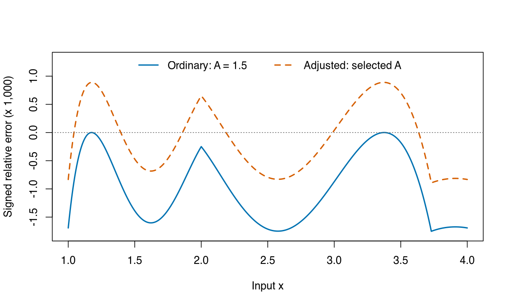

# Fast Reciprocal Square Root R Package, frsrr

## Overview

This R package implements a parameterized Fast Reciprocal Square Root (FRSR) algorithm, also known as Fast Inverse Square Root (FISR), written in C++. You can read more about the FRSR at [0x5f37642f.com](https://0x5f37642f.com/) or see reasons why you might find instrumenting the output fun at [FastInverseSqrt-Visualized on GitHub](https://github.com/hyland-uw/FastInverseSqrt-Visualized).

## Why?

I like R! R doesn't have a type for 32 bit floats, so I wanted a way to mess with the FISR--a 32-bit specific implementation detail (ignoring for now the various extensions to other bases)--in R. Now you can mess with it too!

## Features

- Customizable parameters for fine-tuning accuracy and performance (or the reverse)
- C++ parallel implementation for speed so you can get the wrong answer faster
- Fast sampler to ease sampling over parameter ranges
- Optional detailed output including initial approximation, intermediate steps, and error metrics
- Compare sampled magic constants within input bins or across log2 phases.

## FISR or FRSR?

When the FRSR became famous (and only then), it was referred to as an inverse, meaning "[multiplicative inverse](https://en.wikipedia.org/wiki/Multiplicative_inverse)". 

By contrast, in both the original source of Quake's FRSR tucked away in [a math library since 1986](https://www.netlib.org/fdlibm/e_sqrt.c) and one of the first software libraries ever written--due to Alan Turing, D.G. Prinz, and Cecily Poppelwell--1/sqrt(x) is the "[reciproot](https://0x5f37642f.com/documents/ManchesterRecipRoot.pdf)". Mike Day also argues for the name FRSR in his [2023 generalization of the FRSR](https://arxiv.org/abs/2307.15600) to support any rational power or precision of base. Fame has an inertia all its own, so we shall see which name prevails.

## Installation

Building requires C++20 and RcppParallel >= 5.1.11-2; older bundled TBB headers
can fail to compile with C++20. Install from GitHub using `devtools`:

```R
# install.packages("devtools")
devtools::install_github("Protonk/frsrr")
```

## Usage

```R
library(frsrr)

# NRmax = 0 retains the initial bit-hack approximation.
frsr(c(1, 2, 4), magic = 0x5f3759df, NRmax = 0, tol = 0, threads = 1)

set.seed(123)
samples <- frsr_sample(4, magic_min = 0x5f3759df, magic_max = 0x5f3759df,
                       NRmax = 1, tol = 0, threads = 1, keep_params = TRUE)
samples

set.seed(123)
bins <- frsr_bin(n_bins = 4, float_samples = 64, magic_samples = 32,
                  NRmax = 1, threads = 1)
bins
attr(bins, "settings")

set.seed(42)
frsr_phase(phases = 8, exponents = -2:2, per_cell = 4,
           magics = c(0x5f3759df, 0x5f375a86), NRmax = 1)
```

The worked example below adjusts `A` while holding `B = 0.5`, and uses `detail = TRUE`.

## Adjusting a refinement coefficient

Start with the usual magic constant, `0x5f3759df`, and one refinement with
`A = 1.5`, `B = 0.5`. How are its errors distributed across `[1, 4)`?
The following experiment uses `frsr()` from version 1.1.0. Its 3,072 scan
inputs are spaced by `1/1024`, starting at 1 and stopping just below 4.
Every input is exactly representable in float32, so the double-precision
reference in R targets the same input used by C++. The grid is deterministic;
no RNG seed is needed. All calls use one thread and `tol = 0` to run the
requested number of steps without early stopping.

The complete calculation is in
[`inst/examples/readme-refinement.R`](inst/examples/readme-refinement.R),
including commands to regenerate the PNG. Source it with the local package
loaded, then call `plot_refinement()` and print `comparison` to reproduce
the figure and table. The checks in
[`tests/testthat/test-readme-refinement.R`](tests/testthat/test-readme-refinement.R)
cover input representability, diagnostics, comparisons and the predicted level.
They also run the R code in this README and require each output block below
to match the printed result exactly; after a change, paste in the new output.

```R
library(frsrr)
float32 <- function(x) readBin(writeBin(as.double(x), raw(), size = 4),
                             "double", n = length(x), size = 4)
x_scan <- 1 + (0:3071) / 1024
measure <- function(x, A, steps = 1L) {
  fit <- frsr(x, magic = 0x5f3759df, A = A, B = 0.5, NRmax = steps,
              tol = 0, threads = 1, detail = TRUE, keep_params = TRUE)
  reference <- 1 / sqrt(x)
  fit$signed_error <- (fit$final - reference) / reference
  fit
}
ordinary_scan <- measure(x_scan, 1.5)
range(ordinary_scan$signed_error)
```

```
[1] -1.751523e-03  7.132464e-08
```

More than 99.8% of these signed relative errors are negative, and the
positive ones are tiny. The package's `error` diagnostic is their
absolute value. To account for the asymmetry, write an approximation as
$y = (1 + \varepsilon)/\sqrt{x}$, where $\varepsilon$ is signed relative
error. Substituting this into the ordinary update gives, in exact arithmetic,

$$
\varepsilon_{\mathrm{next}} = -\tfrac12\varepsilon^2(3 + \varepsilon).
$$

For guesses near the target this is nonpositive even if the starting error
is positive. Float32 rounding explains the small positive departures in
the measured range. Since most results are below the target, try raising
`A` slightly while keeping `B = 0.5`:

$$
y_{\mathrm{next}} = y\left((1.5 + d) - 0.5xy^2\right),\qquad d \geq 0.
$$

Scan 121 offsets from zero through `0.0012`, spaced by `0.00001`. Each
candidate sees the same scan inputs. The `float32()` helper rounds coefficients
through binary write/read before selection, matching the package's conversion.
`which.min()` selects the first candidate with the smallest sampled maximum
absolute error.

```R
candidates <- unique(float32(1.5 + (0:120) * 1e-5))
scan_max <- vapply(candidates, function(A) max(measure(x_scan, A)$error),
                   numeric(1))
A_adjusted <- candidates[which.min(scan_max)]
d <- A_adjusted - 1.5
sprintf("A = %.17g; d = %.17g", A_adjusted, d)
c(ordinary = max(ordinary_scan$error), adjusted = min(scan_max))
```

```
[1] "A = 1.5008900165557861; d = 0.00089001655578613281"
    ordinary     adjusted 
0.0017515225 0.0008921299 
```

Keep `A_adjusted` for subsequent calls; retyping a shortened display value
could change the float32 coefficient. The named vector compares scan maxima
for the ordinary and selected coefficients. This is the best tested
coefficient on this grid, not an optimum over all coefficients or float32
inputs.

Check it on a finer grid of 24,576 inputs spaced by `1/8192`. This includes
the scan grid plus 21,504 additional locations, all exactly representable
in float32. Freeze the selected coefficient and also calculate two and
four steps on this same evaluation grid:

```R
x_eval <- 1 + (0:24575) / 8192
steps <- c(1L, 2L, 4L)
ordinary <- lapply(steps, function(n) measure(x_eval, 1.5, n))
adjusted <- lapply(steps, function(n) measure(x_eval, A_adjusted, n))
max_error <- function(fit) max(fit$error)
comparison <- data.frame(steps,
                          ordinary = vapply(ordinary, max_error, numeric(1)),
                          adjusted = vapply(adjusted, max_error, numeric(1)))
```

Plot the signed errors from the one-step runs across the entire interval.
The vertical axis multiplies relative error by 1,000; the dotted line is zero.

```R
plot_refinement <- function() {
  errors <- cbind(ordinary[[1]]$signed_error, adjusted[[1]]$signed_error)
  colours <- c("#0072B2", "#D55E00")
  matplot(x_eval, 1000 * errors, type = "l", lty = c(1, 2), lwd = 2,
          col = colours, xlim = c(1, 4), ylim = c(-1.8, 1.3), xlab = "Input x",
          ylab = "Signed relative error (x 1,000)")
  abline(h = 0, col = "grey40", lty = 3)
  legend("top", c("Ordinary: A = 1.5", "Adjusted: selected A"),
         col = colours, lty = c(1, 2), lwd = 2, bty = "n", horiz = TRUE)
}
plot_refinement()
```



The adjusted curve uses both signs. Its smaller maximum absolute error
does not mean every input improves. On the evaluation grid, 26% of inputs
have larger one-step error after the adjustment: those where the ordinary
signed error is above about `-d/2`, including the region around `x = 2`.

Print maximum absolute relative errors on the **evaluation grid**, with the
same selected `A` at every step:

```R
print(comparison, digits = 6, row.names = FALSE)
```

```
 steps    ordinary    adjusted
     1 1.75215e-03 0.000892827
     2 4.70180e-06 0.000890288
     4 1.02081e-07 0.000889711
```

Ordinary refinement has the smaller maximum after two and four steps.
The adjusted maximum also decreases slightly as steps are repeated.
To locate its remaining error, substitute the adjusted coefficient into
the error equation:

$$
\varepsilon_{\mathrm{next}}
= -\tfrac12\varepsilon^2(3 + \varepsilon) + d(1 + \varepsilon).
$$

An exact answer, $\varepsilon = 0$, maps to error $d$. At a positive
nonzero fixed point, cancelling $y$ from
$y = y((1.5+d)-0.5xy^2)$ gives $xy^2 = 1+2d$, hence
$y_* = \sqrt{1+2d}/\sqrt{x}$ and relative error $\sqrt{1+2d}-1$.

```R
predicted <- sqrt(1 + 2 * d) - 1
four_step <- adjusted[[3]]$signed_error
c(predicted = predicted, min = min(four_step), max = max(four_step))
```

```
   predicted          min          max 
0.0008896208 0.0008895067 0.0008897113 
```

The prediction uses the selected, rounded `A`. The four-step signed errors
lie near this exact-arithmetic fixed point; the separately
rounded float32 operations need not settle at an identical relative error
or a machine fixed point for every input.

## Numerical contract and reproducibility

Inputs must convert to positive normal IEEE-754 float32 values; original values
must not exceed the largest finite float32, `(2 - 2^-23) * 2^127`.
The input and coefficients round to float32, and each operation of
`y * (A - ((B * x) * y) * y)` rounds separately without fused multiply-subtract.
The reference and error measurements use double precision and target the
float32-rounded input, rather than the original R double. Ordinary rounding
with gradual underflow is assumed; fast-math and altered rounding modes are
unsupported.

Sampling uses half-open intervals `[x_min, x_max)`. Log-stratified sampling
selects representable normal float32 values directly; equal magic bounds select
that constant, and reversed magic bounds remain supported.

Use `set.seed()` for sampling and `threads` (or `options(frsrr.threads)`) to
control parallel execution. Random inputs are generated on the main R thread.
Bin candidates share samples, and phase candidates share a grid independent of
candidate order. Bin aggregation uses double precision and fixed reduction order,
so the same samples and build give identical measurements across thread counts.

Search results identify the best tested candidate on the sampled inputs. Exact
bin-objective ties select the smallest magic integer; phase ties compare J,
roughness R, then the smallest magic integer. Candidates with nonfinite
approximations are excluded. 

## Our friends the robots

This project was built with the paid assistance of two AI agents, [Perplexity AI](https://www.perplexity.ai/) and [OpenAI's Codex](https://chatgpt.com/codex). Perplexity AI was used until version `0.8.9`. Codex assisted with later development, including a large refactoring guaranteed by testing. 

## License

This software is released under a variant of the MIT license. Copyright claims have been made on various versions of the FRSR, including [an attempt to sue Microsoft over Copilot's regurgitation of the code](https://www.saverilawfirm.com/our-cases/github-copilot-intellectual-property-litigation?utm_source=chatgpt.com). All are likely to fail or have failed. License text follows:

Permission to use, copy, modify, distribute, and sell this software and its
documentation for any purpose is hereby granted without fee, provided that
the above copyright notice appear in all copies and that both that
copyright notice and this permission notice appear in supporting
documentation.  No representations are made about the suitability of this
software for any purpose.  It is provided "as is" without express or
implied warranty.
